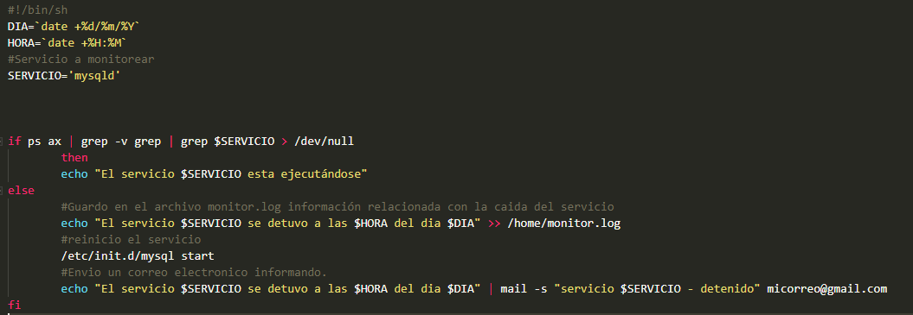

# ¿Cómo monitorear el Servicio Mysql en Linux-Ubuntu ?<!-- omit in toc -->

>Hola, mi nombre es Sebastián Córdoba y el siguiente es un ejemplo para monitorear el servicio de Mysql en una distribución Ubuntu.
  

## Tabla de Contenido<!-- omit in toc -->

- [Script para monitorear Mysql](#script-para-monitorear-mysql)

- [Asignar Permisos al Script](#asignar-permisos-al-script)

- [Programar Tareas](#programar-tareas)

  

## Script para monitorear Mysql
Los Scritps se utilizan para automatizar o realizar tareas sin tener que repetirlas una y otra vez. Para crear uno, seguiremos los siguientes pasos:

1. Creamos un archivo con la extensión **.sh**,  *p.e: <code>touch monitor.sh</code>*
2. Con el editor de preferencia abrimos el archivo   *p.e: <code>nano monitor.sh </code>  o   <code> vi monitor.sh </code>*
3. Una vez abierto el archivo vamos a codear nuestro script. 

	Debemos indicarle a linux que dicho archivo será un script y en donde se encuentra el interprete de comandos en nuestro sistema
~~~
#!/bin/sh
~~~
Tomamos el día , la hora  y le indicamos el servicio que deseamos monitorear.
~~~
DIA=`date +%d/%m/%Y`
HORA=`date +%H:%M`
SERVICIO='mysqld'
~~~

Verifico si el servicio se encuentra arriba, de lo contrario guardo en un archivo llamado **monitor.log** el día y la hora en la que se cayó el servicio, posteriormente lo reinicio y envío un correo informando.
~~~	
if ps ax | grep -v grep | grep $SERVICIO  > /dev/null
	then
		echo  "El servicio $SERVICIO esta ejecutándose"
	else
	#Guardo en el archivo monitor.log información relacionada con la caida 		del servicio
	echo  "El servicio $SERVICIO se detuvo a las $HORA del dia $DIA"  >> /home/monitor.log
	#reinicio el servicio
	/etc/init.d/mysql start
	#Envio un correo electronico informando.
	echo  "El servicio $SERVICIO se detuvo a las $HORA del dia $DIA"  | mail -s "servicio $SERVICIO - detenido" micorreo@gmail.com
fi
~~~

>El script crea un archivo llamado monitor.log, con **>>** indicamos que el archivo  va a guardar la información anterior.

A continuación la imagen del Script:

## Asignar Permisos al Script
Ubicados en el directorio donde tenemos el script, otorgamos permisos al usuario:
<code>chmod 700 monitor.sh</code>
  
## Programar Tareas
**cron:** es un administrador regular de procesos en segundo plano (demonio).Los procesos que deben ejecutarse y la hora en la que deben hacerlo se especifican en el fichero crontab.

**crontab:**  es un simple archivo de texto que guarda una lista de comandos a ejecutar en un tiempo especificado por el usuario.

Para ver los crontabs que tenemos, utilizamos el comando:
<code>sudo crontab -l</code>

Ahora vamos adicionar nuestro script al crontab para que se ejecute cada determinado tiempo con el fin de verificar si el servicio de Mysql esta arriba, de lo contrario procederá a ejecutar lo indicado en el script.

editamos el crontab con <code>sudo crontab -e</code>
y al final del archivo agregamos la siguiente linea.
<code>*/5 * * * * /home/monitor.sh</code>

Lo anterior indica que el script ubicado en la ruta */home/* se ejecutará cada 5 minutos. 
